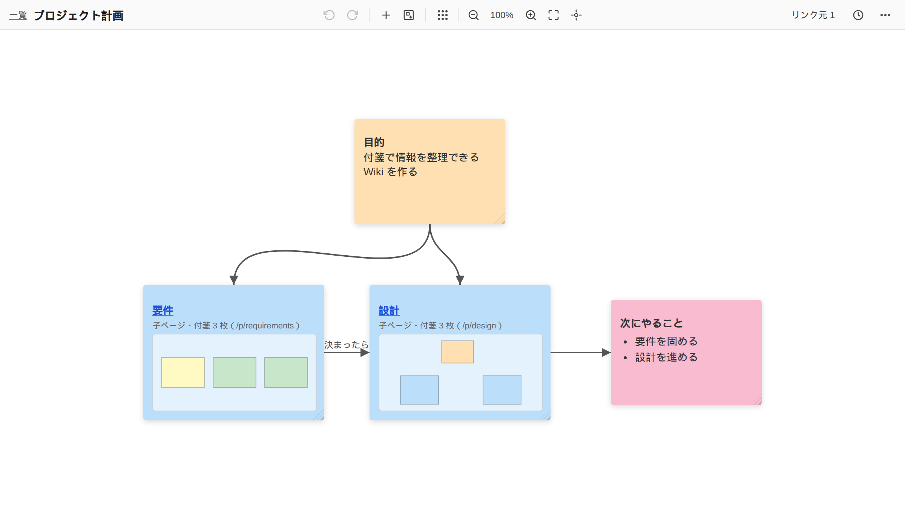

# wema-kake

[](LICENSE)
[](https://github.com/kan/wema-kake/commits/main)
[](https://www.npmjs.com/package/@kanf/wema)
[](https://developers.cloudflare.com/workers/)
[](https://www.typescriptlang.org/)
[](https://modelcontextprotocol.io/)

付箋を並べて書く Wiki です。1 ページが 1 枚のボードで、付箋を置き、線でつなぎ、ページの中に子ページを置いて整理します。Cloudflare Workers で動き、Claude などの LLM からも MCP で読み書きできます。



## できること

- 付箋を置く、動かす、色を付ける、線でつなぐ。箇条書き、チェックリスト、画像、リンクを書ける
- 複数のブラウザで同じページを開くと、変更がその場で反映される
- ページの中に子ページを置ける。子ページは、中の付箋の配置を縮小した図つきの付箋として表示され、押すとズームして入る
- ページの一覧もボードで、ページが付箋、ページ間のリンクが線になる。全文検索で絞り込める
- リモート MCP サーバーを備えていて、claude.ai のコネクタとして登録できる。LLM がボードを読み、付箋を足し、整理する
- LLM の操作は、操作の単位で記録される。ページの画面から、まとめて取り消せる

## wema との関係

名前は、神社で絵馬を掛ける場所「絵馬掛（えまかけ）」から来ています。wema が絵馬、wema-kake がそれを掛ける場所です。

ボードの表示と編集は、付箋ボードのライブラリ [wema](https://github.com/kan/wema)（npm: [`@kanf/wema`](https://www.npmjs.com/package/@kanf/wema)）が受け持ちます。wema は、ブラウザの中だけで動くライブラリです。保存先や同期の仕組みは持ちません。

wema-kake は、wema に次のものを足して Wiki にしたものです。

| wema が受け持つ | wema-kake が足す |
| --- | --- |
| 付箋と接続線の表示と編集 | ページという単位と、ページ間のリンク、ページの階層 |
| Undo / Redo、パンとズーム | サーバーへの保存と、複数のブラウザの間の同期 |
| 変更の内容を表すデータ（デルタ） | 全文検索、画像の保存、認証 |
| | LLM 向けの MCP サーバーと、その操作の取り消し |

wema の側に要る機能は、wema へ依頼して入れてもらい、その版を取り込んでいます。

## 構成

| 役割 | 使っているもの |
| --- | --- |
| サーバー | Cloudflare Workers + [Hono](https://hono.dev/) |
| ページの内容と同期 | Durable Objects（1 ページ = 1 オブジェクト、SQLite、WebSocket） |
| ページの一覧と全文検索 | D1 |
| 画像 | R2 |
| 認証 | Cloudflare Access |
| LLM との連携 | リモート MCP（OAuth 2.1。ログインは Access for SaaS） |

## デプロイ

[](https://deploy.workers.cloudflare.com/?url=https://github.com/kan/wema-kake)

ボタンを押すと、リポジトリを自分のアカウントへ複製し、D1、KV、R2 を作って、Worker をデプロイします。ボタンからのデプロイは、作者の環境では試していません。うまくいかない場合は、下の「手動でのデプロイ」を使ってください。

**デプロイしただけでは、まだ使えません。** Cloudflare Access を設定するまで、データを読み書きする API は 500 を返します（保護のない状態で公開しないためです）。続けて、次を設定します。

1. 画面用の Access アプリケーション（Self-hosted）を作り、チームドメインと AUD タグを、Worker の変数 `ACCESS_TEAM_DOMAIN` と `ACCESS_AUD` に入れる
2. MCP を使う場合は、MCP 用のパスを Access から外し、Access for SaaS（OIDC）のアプリケーションを作って、secret を入れる

手順の詳細と、つまずきやすい点は、[AGENTS.md の「デプロイ」](AGENTS.md#デプロイ)に書いてあります。

### 手動でのデプロイ

```sh
git clone https://github.com/kan/wema-kake.git
cd wema-kake
npm install

# デプロイ先ごとの値を書く設定を作る（git には入らない）
cp wrangler.jsonc wrangler.deploy.jsonc

npx wrangler d1 create wema-kake
npx wrangler kv namespace create OAUTH_KV
npx wrangler r2 bucket create wema-kake-images
# 表示された ID と、Access の値を wrangler.deploy.jsonc に書く

npm run deploy
```

`npm run deploy` は、`wrangler.deploy.jsonc` があればそれを使い、D1 のマイグレーションを適用してからデプロイします。

## ローカルでの開発

```sh
npm install
cp .dev.vars.example .dev.vars
npx wrangler d1 migrations apply DB --local
npm run dev
```

`http://localhost:8787/` で開けます。ローカルでは Access を通らず、`.dev.vars` の `DEV_USER_EMAIL` が利用者になります。

| コマンド | 内容 |
| --- | --- |
| `npm run dev` | 画面をビルドして、ローカルのサーバーを起動する |
| `npm test` | テストを実行する（Workers のランタイムの上で動く） |
| `npm run lint` | 型チェック |
| `npm run deploy` | ビルドしてデプロイする |

## 文書

- [AGENTS.md](AGENTS.md): 設計と、実装で守る決まり。コーディングエージェント向けの指示を兼ねる
- [docs/plan.md](docs/plan.md): 実装の計画と、フェーズごとの記録

## ライセンス

[ISC](LICENSE)
